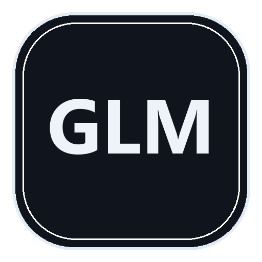

# GlassLiquidMalvis

A glass finish for the Seelen UI dock, toolbar, launcher and popups. Ported from
[Aurora Glass](https://github.com/burgess1202/aurora-glass-seelen-ui) and rebuilt
for low cost on weak GPUs.

## Install

1. Download `GlassLiquidMalvis.slu` from this repo.
2. Open Seelen Settings, go to Resources, import the `.slu` file.
3. Activate it in the Themes list.

## Settings

Every option ships in English and Indonesian.

| Group | Option | Values |
|---|---|---|
| Performance | Freeze all motion | 0 = short one-shot transitions, 1 = freeze everything |
| Layout | Compact toolbar | 0 = off, 1 = slimmer pills |
| Layout | Toolbar font | 0 = mono, 1 = system |
| Performance preset | Quality preset | 0 = Potato, 1 = Balanced, 2 = High |
| Extreme saver | Extreme saver mode | 0 = off, 1 = flat panels, no blur, no shadow, no motion |
| Media panels | Dock media tile | Seelen long bar or square glass tile |
| Media panels | Dock media art | 0 = Full art, 1 = Lite, 2 = Hidden |

Potato forces low blur, small corners, no dock wave and no motion. Balanced uses
your own values. Extreme saver cannot cap the GPU at a fixed percent, it only
removes the costly layers.

## Performance notes

Continuously running keyframes from the source theme are shipped as still frames,
motion plays once per interaction, and the toolbar keeps a single blur surface.
If the GPU still spikes while moving over the dock, turn off the dock wave,
pick Potato, or enable Extreme saver. In Seelen Settings, Minimal or Extreme
performance mode plus disabled dock thumbnails lower the cost further.

## Credits

Derivative of Aurora Glass by burgess1202, link above. GlassLiquidMalvis keeps
the look and removes the parts that cost frames.

